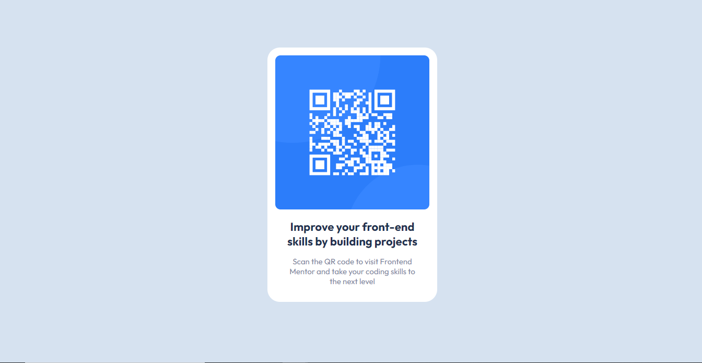

# Frontend Mentor - QR code component solution

This is a solution to the [QR code component challenge on Frontend Mentor](https://www.frontendmentor.io/challenges/qr-code-component-iux_sIO_H). Frontend Mentor challenges help you improve your coding skills by building realistic projects. 

## Table of contents

- [Overview](#overview)
  - [Screenshot](#screenshot)
  - [Links](#links)
- [My process](#my-process)
  - [Built with](#built-with)
  - [What I learned](#what-i-learned )
- [Author](#author)
- [Acknowledgments](#acknowledgments)

**Note: Delete this note and update the table of contents based on what sections you keep.**

## Overview

### Screenshot

  

### Links

- Solution URL: [Github Link](https://github.com/Ravijhabit/FrontendMiniChallenge/tree/main/qr-code-component-main)
- Live Site URL: [QRCode-Component](https://frontend-mini-challenge.netlify.app/qr-code-component-main/index.html)

## My process

### Built with

- Semantic HTML5 markup
- CSS custom properties
- Mobile-first workflow

### What I learned

Some of my learnings while working through this project are:
 using google fonts
 using custom css
 

## Author

- Website - [Ravi Jha ](https://ravijhaportfolio.netlify.app/)
- Frontend Mentor - [Ravijhabit](https://www.frontendmentor.io/profile/Ravijhabit)

## Acknowledgments

I would like to thank Frontend Mentors for creating such a wonderful challenges which encouraged me to create this website.